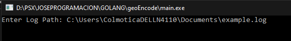
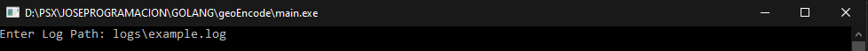
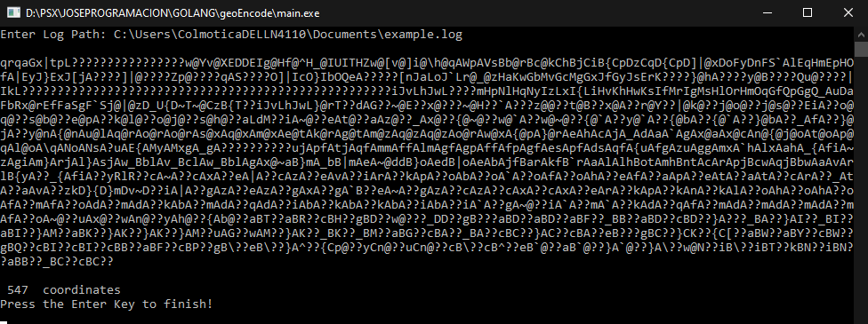

# GEOENCODE GO CLI APP

## DESCRIPTION
This is a Go Cli app that receives an string path to a log file, and based on it generates 
and prints in console an encoded polyline with the locations found in the log file.

### HOW TO RUN IT...
- Be sure that you have the Go env installed, FMI visit [golang.org](https://golang.org/), 
and RUN the `main.go` file in the console with:

```
$go run main.go
```

if you like Simplify things, just execute 
```
main.exe
```
This Prompts for the path where the Log file is, So you can type (no spaces)
the log path, for example.
```
C:\Users\myuser\Documents\example.log
```


or you can use the `example.log` given that is in `logs/example.log`



as a result you can see the polyline and the number of coordinates found



### DISCLAIMER
in order to encode the coordinates I'm using the [go-polyline](https://github.com/twpayne/go-polyline) library from [twpayne](https://github.com/twpayne)

## License

BSD-2-Clause


